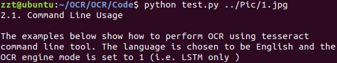

# 环境部署 #
## 配置：
*   Ubuntu18.04
*   python2.7
*   Tesseract library (libtesseract)
*   Command line Tesseract tool (tesseract-ocr)
*   Python wrapper for tesseract (pytesseract)

## 过程：
1.  Install Tesseract 4.0 on Ubuntu 18.04  
```
    sudo apt install tesseract-ocr
    sudo apt install libtesseract-dev
    sudo pip install pytesseract
    tesseract --version(check if it is deployed correctly)
```
2.  Tesseract Basic Usage  
    parameter analysis:  
    *   Input filename: source picture relative path
    *   OCR language: the language you use. eg. -l eng
    *   OCR Engine Mode (oem): Tesseract 4 has two OCR engines. eg. --oem 1
        *   0    Legacy engine only.
        *   1    Neural nets LSTM engine only.
        *   2    Legacy + LSTM engines.
        *   3    Default, based on what is available.
3.  Command Line Usage:  
```
    $ tesseract image.jpg stdout -l eng --oem 1 --psm 3
```
4.  pytesseract Usage:  
    in ~/Code:  
```
    $python test.py ../Pic/1.jpg
```
Source picture:  
  
Output:  


## Problem:  
1.  in "sudo pip install pytesseract":  ImportError: cannot import name main  
    *   sudo gedit /usr/bin/pip  
    *   modify "from pip import main" to "from pip._internal import main"  

2.  in "python test.py ...": ImportError: cannot import name cv2  
    *   sudo pip install opencv-python

