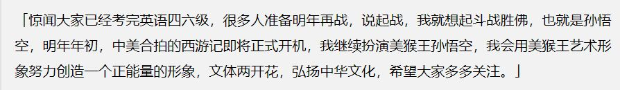
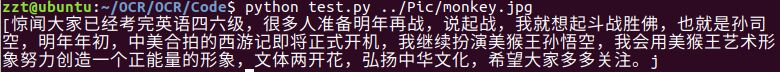

# 使用不同的字符集 #
## 字符集
*   什么是字符集？  
字符(Character)是各种文字和符号的总称，包括各国家文字、标点符号、图形符号、数字等。字符集(Character set)是多个字符的集合，字符集种类较多，每个字符集包含的字符个数不同，常见字符集名称：ASCII字符集、GB2312字符集、BIG5字符集、 GB18030字符集、Unicode字符集等。
*   tesseract如何使用字符集来识别？  
在Linux环境下，tesseract安装在了/usr/share/tesseract/4.00目录下，里面只有一个tessdata文件夹，里面存放的就是各种不同不同的字符集以及一些相关的config文件。字符集都以.traineddata为后缀。在环境部署时的test.py里有 “-l eng”这样的config，即代表使用的是eng.traineddata这个字符集来识别图片的。想使用自己训练生成的字符集只需要修改这个config即可。
*   如何训练自己的字符集？  
    *   在window环境下安装jTessBoxEditor。  
    *   将源图片转换成tif格式，用于生成box文件。直接另存为即可。
    *   更改名字为[lang].[fontname].exp[num].tif的格式。  
        *   lang：语言
        *   fontname：字体
        *   num：代表自身的数字
    *   生成box文件：
    ```
    tesseract mjorcen.normal.exp0.jpg mjorcen.normal.exp0 -l chi_sim batch.nochop makebox
    ```
    *   打开jTessBoxEditor矫正错误
    *   训练：
    ```
    tesseract  mjorcen.normal.exp0.jpg mjorcen.normal.exp0  nobatch box.train

    unicharset_extractor mjorcen.normal.exp0.box
    ```
    *   新建font_properties文件，输入normal 0 0 0 0 0表示默认普通
    *   继续输入：
    ```
    shapeclustering -F font_properties -U unicharset mjorcen.normal.exp0.tr

    mftraining -F font_properties -U unicharset -O unicharset mjorcen.normal.exp0.tr

    cntraining mjorcen.normal.exp0.tr
    ```
    *   此时有五个新生成的文件，把这些文件最前面加上前缀：normal，再执行以下命令：
    ```
    combine_tessdata normal.
    ```
    *   即可得到训练好的字库：normal.traineddata。将该字库移入Linux环境下tessdata里，修改test.py即可使用自己训练的字库了。
*   使用自定义字库效果：  
Source:  

Output：
  
很容易发现该识别并不是完美的，例如像孙悟空识别成了孙司空等等，这说明需要更为精确的字符集。

